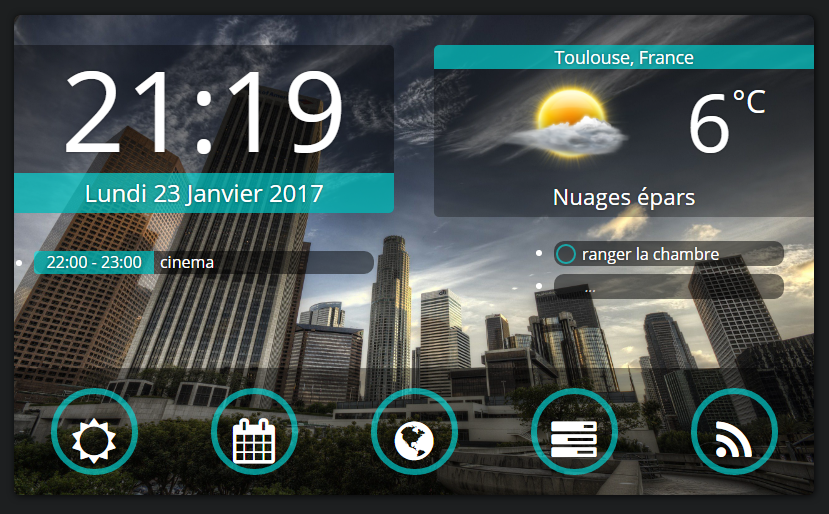

Home portal integration
=======================

Version: 0.9
------------

 

/!\\ Important:
---------------

\-- **Need to be install on a webserver. (cross origin issue).**

**-- Currently only available in French.** You can manually edit files for have
a translation.

I hope an English version gonna be release very soon.

 

/!\\ Bug:
---------

-   To do list add item cant be select just after add, need to save and reload
    page.

 

Description:
------------

Home portal integration is an open source backend integration of **Icebob**
project: [home portal - codepen](https://codepen.io/icebob/pen/yNpgqR)).

**What is it:**

Its a graphical user interfarce based on js, html, css, php give you daily
informations like google agenda, to do list, weather, news ...

 

Languages:
----------

-   HTML5

-   CSS3

-   JS

-   PHP7

 

Configuration:
--------------

The most part of configuration is available in the file ./js/variables.js

By default the todo list is save in a text file in ./to-do-list/liste.txt

If you want change this location you need to change the path in
./to-do-list/write.php **and** ./js/read.js

**Note:**

If you want have aces to your app everywhere,

You can place your list and ./write.php and liste.txt in a webserver and edit
read.js for specify the new path.

 

Improvement
-----------

If you want participate to this project, this is few ideas of improvements:

-   Database support for to do list.

-   Variable switch for translate French to English.

 

Licence
-------

### Frontend =\> **Ask to icebob**

### Backend =\> MIT, just quote this repo.
